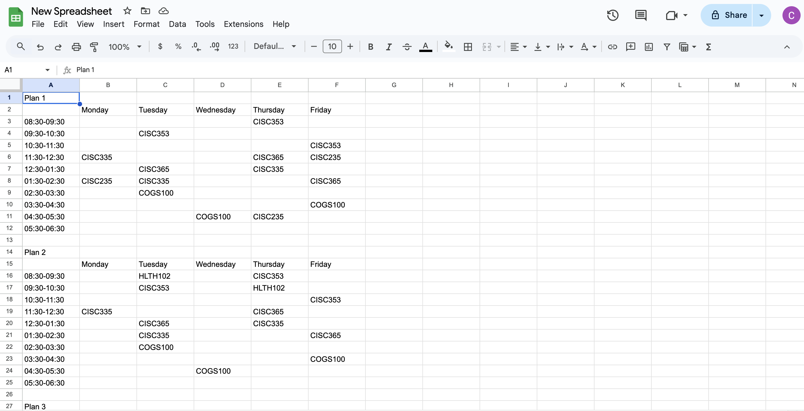

### Queens Course Scheduler

This project is meant to make course scheduling easier, faster and more efficient. Instead of writing out your potential class schedules by hand you can simply put the course data into a csv file and let this program create all possible schedules with the courses that you give it.

For example, a standard class schedule consists of 5 courses for the term. Let's say you have chosen 7 courses that you would potentially want to take for the term but you don't want to figure out which courses you can take together all by hand. You can put all 7 courses into the csv file located at ```src/main/resources/courseData.csv``` and follow the format of the courses currently in the file. When you run the program, a browser will open prompting you to login to your google account for verification so that the course shedules can be output to a google sheet so that you can visually see them.

## running the program

# using VS Code

make sure to install java extension as well as Maven

```bash 
mvn clean compile
mvn exec:java -Dexec.mainClass="com.QueensScheduler.SheetsServiceUtil"
```

## Screenshots


